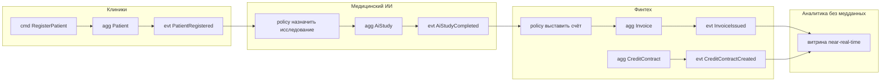

# План выполнения «Задание 4» кейса «Будущее 2.0» (DDD + событийная модель)

## Цель
Создать пакет DDD/event-driven артефактов в `Task4Advanced/`, согласованный с целевой C4-архитектурой из `Task3Advanced/` (Kafka + Schema Registry + DLQ, Data Mesh, ACL-мосты над DWH/Camel). Стиль — как в Task3: лаконичные буллеты/таблицы, диаграммы вынесены в standalone `.puml` под `diagrams/`, ссылки из markdown.

## Границы (SCOPE)
- Изменяем только `Task4Advanced/`. Другие Task-папки не трогаем.
- Язык — русский. Формат — markdown + PlantUML.
- PlantUML: парные `@startuml/@enduml`, корректные макросы/легенды. Стиль include как в Task3 (C4-PlantUML или чистый PlantUML для нотации Event Storming).

## Согласованность (инварианты качества)
- Домены единые между `bounded-contexts.md`, `aggregates.md`, `events.md`, `event-storming.md` и Task3: Клиники/Пациентский поток, Финтех/Банкинг, Медицинский ИИ, Фарма, Медтехника/IoT, Головной офис/Корпоративный + сквозные: IAM, Аналитика/Витрина.
- Имена событий идентичны в `events.md` и `event-storming.md` (PascalCase, прошедшее время).
- ACL-обёртки над легаси DWH и Camel показаны как временные мосты (связь с этапами 0–6 / 6–18 / 18–36 мес из Task3).

---

## Доменная модель (черновик — на согласование)

### Домены и bounded contexts
| Домен | Bounded contexts (черновик) | Роль клиента |
| --- | --- | --- |
| Пациентский поток / Клиники | Регистрация пациента, Приёмы/Назначения, Медкарта (вне аналитики) | Клиент = пациент |
| Финтех / Банкинг | Счета, Кредиты, Платежи, Кредитный риск | Клиент = держатель счёта |
| Медицинский ИИ | Инференс/Исследования, Каталог ИИ-моделей | — |
| Фарма | Каталог препаратов, Поставки/Дистрибуция | — |
| Медтехника / IoT | Реестр устройств, Телеметрия | — |
| Головной офис / Корпоративный | Мастер-данные клиента (MDM), HR/Финансы/Инвентарь | Единый профиль человека |
| IAM (сквозной) | Идентичность, Доступ (RBAC/ABAC), Согласия/Consent | — |
| Аналитика / Витрина (сквозной) | Семантический слой, Потоковые витрины (без медданных) | — |

Ключевая развилка: **пациент** (Клиники) и **клиент банка** (Финтех) — разные контексты одного человека; связь через MDM-профиль (Головной офис) и Published Language.

### Типы связей DDD в Context Map
Partnership, Customer–Supplier, Conformist, ACL, OHS, Published Language, Shared Kernel. ACL — над DWH и Camel (временные мосты).

### Ключевые агрегаты (черновик)
Кредитный договор (Финтех), Пациент/Регистрация (Клиники), Исследование ИИ (Мед. ИИ), Счёт/Платёж (Финтех), Медицинское устройство/Телеметрия (IoT), Поставка препарата (Фарма), Профиль клиента/MDM (Головной офис).

### Каталог событий (черновик, 10–15)
Обязательные: `CreditContractCreated`, `PatientRegistered`, `AiStudyCompleted`.
Дополнительные: `AccountOpened`, `PaymentProcessed`, `LoanRepaymentReceived`, `DeviceRegistered`, `DeviceTelemetryReceived`, `DrugShipmentDispatched`, `DrugShipmentDelivered`, `CustomerProfileUpdated`, `ConsentGranted`, `AppointmentScheduled`, `AiStudyRequested`, `InvoiceIssued`.

### Формат диаграммы Event Storming (решение)
Полноценный **цветной Event Storming на чистом PlantUML** по канону, с легендой цветов:
- события (Domain Event) — оранжевые `#FFB84D`
- команды (Command) — синие `#4DA6FF`
- агрегаты (Aggregate) — жёлтые `#FFE680`
- политики/реакции (Policy) — сиреневые `#C299FF`
- внешние системы / read-model (External/View) — зелёные/розовые
Элементы — `rectangle` со `skinparam`/`<<стереотип>>`, поток слева-направо: команда → агрегат → событие → политика → команда/подписчик. На каждое ключевое событие явно виден источник и подписчики. Легенда через блок `legend`.

### Сквозные сценарии Event Storming (2–3)
1. Регистрация пациента → назначение исследования ИИ → результат ИИ → выставление счёта в Финтех.
2. Открытие счёта → выдача кредитного договора → платёж/погашение → обновление риск-профиля.
3. Регистрация устройства медтехники → приём телеметрии → реакция клиники/алерт; поставка препарата → уведомление клиники/аналитики.

---

## Список артефактов (deliverables)
1. `Task4Advanced/bounded-contexts.md` + `Task4Advanced/diagrams/bounded-contexts.puml` — домены, bounded contexts, ubiquitous language, Context Map с типами связей DDD, таблица контекстов, ACL над DWH/Camel.
2. `Task4Advanced/aggregates.md` — агрегаты по доменам: границы, корень, инварианты, идентификаторы, value objects; акцент «агрегат = граница согласованности и источник событий».
3. `Task4Advanced/events.md` — каталог доменных событий: имя | контекст-источник | семантика | минимальный контракт (поля + ключ партиционирования) | подписчики; конвенции именования, связь со Schema Registry/DLQ.
4. `Task4Advanced/event-storming.md` + `Task4Advanced/diagrams/event-storming.puml` — цветная нотация (команды/агрегаты/события/политики/внешние), producer/subscriber на каждое ключевое событие, 2–3 сквозных сценария.
5. `Task4Advanced/justification.md` — обоснование событийного подхода + сравнительная таблица (Аспект | Camel/DWH сейчас | Событийная архитектура), привязка к стадиям 0–6/6–18/18–36 мес и роли ACL.
6. `Task4Advanced/README.md` — индекс артефактов + executive summary (2–3 предложения).

---

## Порядок работ
- [ ] 1. Создать `bounded-contexts.md` и `diagrams/bounded-contexts.puml` (Context Map с DDD-связями + ACL-мосты).
- [ ] 2. Создать `aggregates.md` (агрегаты по всем доменам, обязательные примеры покрыты).
- [ ] 3. Создать `events.md` (10–15 событий, обязательные включены, конвенции + Schema Registry/DLQ).
- [ ] 4. Создать `event-storming.md` и `diagrams/event-storming.puml` (цветная схема + 2–3 сквозных сценария; имена событий сверены с events.md).
- [ ] 5. Создать `justification.md` (сравнительная таблица + привязка к стадиям/ACL).
- [ ] 6. Создать `README.md` (индекс + executive summary); финальная сверка доменов и имён событий по всем файлам.
- [ ] 7. `attempt_completion` со сводкой (файлы, домены/контексты, число и примеры событий, ключевые аргументы).

## Диаграммы Mermaid — обзор потока Event Storming

